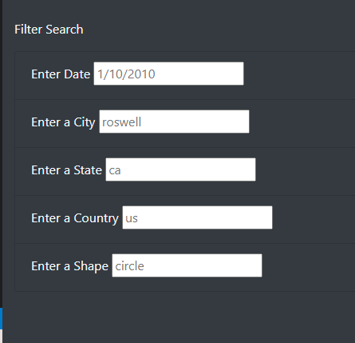
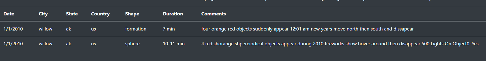

# UFOs

## Overview of UFO Analysis

### Purpose

The purpose of this project is to assist Dana, a data journalist, in producing a webpage via JavaScript detailing and analyzing UFO sightings from different cities around the world. 

## Results 

### Results UFO Analysis
In order to conduct a search, the user must enter the desired information, in the correct format, into the search bar located in the left hand side of the webpage (Figure 1). If one wants to filter their search to a specific city, one would only need to enter the name of the city into the city search bar and the webpage will comb through the Java Script file and output results from city specified. For example, in Figure 2, the city of willow was entered into the search bar, and two results for the city came up.  

#### Figure 1
    

#### Figure 2
  
 

## Summary

~~There are several changes in the updated school district analysis after reading and math scores for the ninth grade at Thomas High School have been replaced with NaNs. First of all, the overall passing percentage of its students has decreased. Second, there is a decrease in the overall passing rate of medium-sized schools. Thirdly, compared to district schools, the chartered schools category has decreased in its performance. Finally, the $630 - $644 spending range category has overall decreased in passing percentages.~~  

